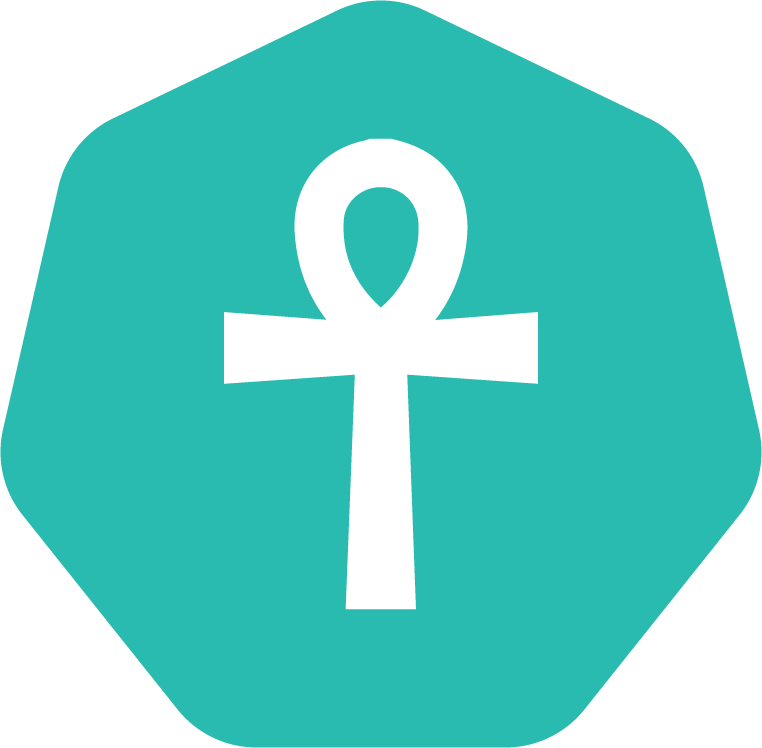

# Ankh [](https://travis-ci.org/appnexus/ankh)


Another Kubernetes Helper for shipping code.

## Dependencies
Ankh uses `helm` and `kubectl` - make sure you install them.

- Kubectl **>= 1.8.6** - https://kubernetes.io/docs/tasks/tools/install-kubectl/
- Helm **>= 2.7** - https://github.com/kubernetes/helm

## Build and Installation

### Using `make`
```
make # builds to ankh/ankh
```
```
make install # installs to $GOPATH/bin
```

### Using `go get`
```
go get github.com/appnexus/ankh/ankh
```

### Using Homebrew
```sh
brew tap appnexus/ankh https://github.com/appnexus/ankh.git
brew install ankh
```

## Introduction

Ankh helps manage application deployments across various Kubernetes clusters and namespaces. Users manage their deployments using Helm charts, but without the additional complexity of running Tiller.

Simplicity, transparency and composability are the primary design goals of Ankh. Under the hood, Ankh wraps **helm** and **kubectl**.

Ankh can manage multiple charts using an Ankh file:

```
$ cat ankh.yaml
charts:
  - name: theserver
    namespace: bar
    version: 0.0.1

  - name: myservice
    namespace: foo
    version: 1.0.0
```

...or a single chart


```
$ ankh apply --chart haste-server@0.0.1
```

## Operations

Most Ankh commands call `helm`, `kubectl`, or both.

**template** runs `helm template` with all derived yaml values.

**apply** runs `kubectl apply` using the `helm template` output.

**explain** outputs a bash-compatible representation of the underlying invocations to `helm template` and `kubectl apply` as they would be run during `ankh apply`

**get, logs, exec, rollback, diff** run common kubectl operations using Ankh's context and environment semantics.

### Other operations

Ankh provides a few commands for managing key artifacts: Helm charts and Docker images.

**image** lets you view docker images in a remote registry.

**chart** lets you view and publish chart artifacts in a remote registry.

**create** lets you create a new helm chart based on a starter chart.

## Behavior

### Chart version prompt

Ankh usually attempts to prompt the user for missing information instead of failing. For example, if a chart is missing a version (either missing on the command line using --chart or missing in an Ankh file), Ankh will use the configured Helm registry URL to fetch available vesions for the chart and prompt for which to use.

### Tag value prompt

Often, charts are written in a way such that there is a deployment whose pod spec has a primary container with a configurable image tag. E.g. for tagValueName="tag"

```
      containers:
      - name: theserver
        image: docker.myorganization.net/theserver:{{ .Values.tag }}
        env:
           ...
```

If a tag value is not set on the command line as `--set $tagValueName=...`, Ankh can use the configured docker registry `docker.registry` to prompt the user for a tag value. This can be enabled by setting `helm.tagValueName` to the name of the variable used in your deployment templates for the primary container's image tag. E.g

```
helm:
  # the helm variable name `tag` canonically means primary image tag across all
  # of the charts we author and manage
  tagValueName: tag
```

### Kubectl label selection vs columns

Ankh operations that read from Kubernetes use templated Helm charts manifests to know which objects to operate over. Specifically, Deployments and StatefulSets are scraped for labels that can be used to select Pods. To allow for flexibile label behavior, Ankh exposes `kubectl.wildcardSelectorLabels` to configure which labels present on a Deployment or StatefulSet should not be included when querying for Pods, and should be shown as columns in any output text, when appropriate. E.g.

```
kubectl
   wildcardSelectorLabels:
   # The following labels exist on Deployment objects, but for the purpose of
   # selecting pods, we should not consider them for equality checks, and instead
   # show them as columns in `get` etc output. We do this because the `tag` label
   # is set to `.Values.tag` and chart is set to `.Chart.Version`, both of which
   # are potentially highly variable and should be shown shown instead of selected
   against. useful to see in `get` output and and, most importantly
   - tag
   - chart
```

## Configuration

### Contexts

**Ankh** configs are driven by *contexts*, like kubectl.

```
$ cat ~/.ankh/config
contexts:
  minikube-local:
    kube-context: minikube
    environment-class: production
    resource-profile: constrained
    release: minikube
    helm-registry-url: https://helm-registry.myorganization.net/repo/
    global:
      some-value: 'needed by all charts'
$ ankh --context my-context apply
```

You can view available contexts from your Ankh config using:

```
ankh config get-contexts
```

...and use one use during execution


You can also specify the context to use via a command line flag:

```
ankh --context my-context apply
```

You may include other yaml config files into your Ankh config using `include`. This is useful when you need to maintain a consistent view of ankh configuration, perhaps across multiple developers on a team. Included files may be remote HTTP resources or local files on the filesystem. E.g.

```
$ cat ~/.ankh/config
include:
- https://some-config-server.net/production.yaml
- https://some-config-server.net/staging.yaml
...
```

#### Context-aware yaml config

One of the primary features of Ankh is the ability to write context-aware yaml configuration for Helm charts. Often, it's necessary to have separate values for classes of operating environments, like `dev` and `production`. For example, we may want to set the log level or

##### In a Helm chart:

Ankh supports reading from three special files in a chart, in the following order of precedence:

* ankh-values.yaml
* ankh-resource-profiles.yaml
* ankh-releases.yaml

See YAML schemas below for more on `values`, `resource-profiles`, and `releases`.

##### In an Ankh file:

Ankh also supports reading from the `values`, `resource-profiles`, and `releases` keys in the Chart object in an Ankh file for context-aware yaml. The structure is the same as the yaml structure when these values are in ankh-*.yaml files in the Helm chart.

### Environments
Environments are a list of context names. Using an environment, you can manage multiple contexts as a single logical environment. One example of this use case is to have multiple geo-distributed clusters that you want to deploy to as part of a "staging" environment:

```
contexts:
  nym-staging:
    ...
  ams-staging:
    ...
  lax-staging:
    ...
environments:
  staging:
    contexts:
    - nym-staging
    - ams-staging
    - lax-staging
```

When you invoke Ankh using `--environment`, it will operate over each of the contexts defined in the environment in the order listed. E.g.

```
ankh --environment staging apply
```

This will run `apply` over contexts `nym2-staging`, `ams1-staging`, and `lax-staging` in that order.

### Ankh files

An Ankh file, typically named ankh.yaml, can be used as a description file for what Ankh should do.

```
$ cat ankh.yaml
charts:
  - name: theserver
    namespace: bar
    version: 0.0.1

  - name: myservice
    namespace: foo
    version: 1.0.0
```

When invoked, Ankh will operate over both the `haste-server` and `myservice` charts.

## YAML schemas

#### `AnkhConfig`

| Field                         | Type                     | Description                                                                                                                                                                                                                        |
| -------------                 | :---:                    | :-------------:                                                                                                                                                                                                                    |
| include                       | []string                 | A list of Ankh config references to load and merge into this Ankh config. May be a local file or an HTTP resource to GET.														|
| environments                  | map[string]`Environment` | A mapping from environment name to `Environment` objects. Helps organize Context objects as logical environments for the purpose of operating on many contexts at once.                                                            |
| contexts                      | map[string]`Context`     | A mapping from context names to `Context` objects. Analogous, but not equivalent, to contexts in a kubeconfig.                                                                                                                     |
| kubectl                       | `KubectlConfig`            | Configuration for Kubectl. |
| helm                          | `HelmConfig`               | Configuration for Helm . 	|
| docker                        | `DockerConfig`             | Configuration for Docker.	|
| slack                         | `SlackConfig`              | Configuration for Slack.   |

#### `KubectlConfig`
| Field         | Type     | Description                                                                                                        |
| ------------- | :---:    | :-------------:                                                                                                    |
| wildCardLabels      | []string | A list of object labels that should be treated as wildcards when peforming read operations using Kubectl (eg: get, logs). These labels will not be used for selecting using `-l` with kubectl, and instead will be shown as columns (when appropriate) using `-L` with kubectl. |


#### `HelmConfig`
| Field         | Type     | Description                                                                                                        |
| ------------- | :---:    | :-------------:                                                                                                    |
| tagValueName      | string | The name of the Helm value that corresponds to a Chart's `tag` ie: the primary container's docker tag. If set, Ankh will prompt the user for a value if this is not set on the command line via `--set $tagValueName=...` for `apply` and `template` operations, and assume a benign default value in other cases for the purpose of templating charts for suboperations. |
| registry          | string | The Helm registry to use. This is always used by `ankh chart ...` subcommands, and it is the default registry used when operating over `Chart` objects unless overriden. See the `Chart` object in an Ankh file.		|
| authType          | string | The authentication type to use for the Helm registry. Only `basic` auth is supported, which means you must provide a username and password on `ankh chart publish` and other authenticated helm registry commands.	|

#### `DockerConfig`
| Field         | Type     | Description                                                                                                        |
| ------------- | :---:    | :-------------:                                                                                                    |
| registry      | string | The docker registry to use. This is always used by `ankh image ...` subcommands and is also used by other commands to produce prompts, typically when `helm.tagValueName` is set and Ankh sees that no tag value has been provided. |

#### `SlackConfig`
| Field         | Type     | Description                                                                                                        |
| ------------- | :---:    | :-------------:                                                                                                    |
| token      | string | Bot token used to connect to slack team |
| icon-url      | string | Optional. Url of icon to be used when message is posted to slack. Default is the ankh logo. |
| username      | string | Optional. Username associated with message when posting message to slack. Default is `ankh` |
| format        | string | Optional. Format of slack message that will be used. See available variables below. |
| rollbackFormat | string | Optional. Format of message for rollbacks that will be used. See available variables below. |
| pretext       | string | Optional. Pretext for slack message. Default is `A new release notification has been received`. |

#### `JiraConfig`
| Field         | Type     | Description                                                                                                          |
| ------------- | :---:    | :-------------:                                                                                                      |
| baseUrl              | string | Required. Url of JIRA instance                                                                                  |
| queue                | string | Required. Queue to create the ticket in                                                                         |
| autoClose            | bool   | Optional. Auto-Close JIRA ticket created. Defaults to false.                                                    |
| summaryFormat        | string | Optional. Format of JIRA summary that will be used. See available format variables below.                       |
| rollbackSumaryFormat | string | Optional. Format of JIRA summary for rollbacks that will be used. See available format variables below.         |
| descriptionFormat        | string | Optional. Format of JIRA description that will be used. See available format variables below.               |
| rollbacDescriptionFormat | string | Optional. Format of JIRA description for rollbacks that will be used. See available format variables below. |

#### `Environment`
| Field         | Type     | Description                                                                                                        |
| ------------- | :---:    | :-------------:                                                                                                    |
| contexts      | []string | A list of contexts to that belong to this Environment. These must be valid context names present under `contexts`. |

#### `Context`
| Field             | Type     | Description                                                                                                                                                                    |
| -------------     | :---:    | :-------------:                                                                                                                                                                |
| kube-context      | string   | The kube context to use. This must be a valid context name present in your kube config (tyipcally ~/.kube/config or $KUBECONFIG). Prefer `kube-server` instead, which is less dependent on local configuration. |
| kube-server       | string   | The kube server to use. This must be a valid Kubernetes API server. Similar to the `server` field in kubectl's `cluster` object. This can be used in place of `kube-context`, and should be preferred. |
| environment-class | string   | Optional. The environment class to use.                															|
| resource-profile  | string   | Optional. The resource profile to use.                    															|
| release           | string   | Optional. The release name to use. This is passed to Helm  as --release                                                                                                        |
| helm-registry-url | string   | Optional. The URL to the Helm chart repo to use. Overrides the global Helm registry. Either this or the global registry must be defined. 					|
| global            | RawYaml  | Global yaml values: available to all charts                                                                                                                                   |

#### `AnkhFile`
| Field              | Type     | Description                                                                                           						|
| -------------      | :---:    | :-------------:                                                                                       						|
| namespace          | string   | The namespace to use when running `helm` and `kubectl`. Overrides all namespaces at the Chart level. DEPRECATED - will be removed in Ankh 2.0         |
| charts 	     | Chart    | The set of charts to operate over. All charts within a namespace are applied with a single `kubectl` invocation. Namespaces are applied in alphabetical order. Charts with an empty namespace are applied first. Use `dependencies` to achieve a custom `execution ordering. |
| dependencies       | []string | Optional. Paths to dependent Ankh files (eg: an ankh.yaml) that should be executed first, in order. May be a local file or an HTTP resource to GET.	|

#### `Chart`
| Field             | Type               | Description                                                          				|
| -------------     | :---:              | :-------------:                                                      				|
| name              | string             | The chart name. Must be the name of a chart in a Helm registry					|
| version           | string             | Optional. The chart version, if pulling from a Helm registry.                			|
| path              | string             | Optional. The path to a local chart directory. Can be used instead of a remote `version` in a Helm registry.  		|
| meta              | ChartMeta          | The chart metadata to use. Overrides any metadata in `ankh.yaml` present in the Chart.               |
| default-values    | RawYaml            | Optional. Values to use in all contexts.   			|
| values            | map[string]RawYaml | Optional. Values to use, by environment class. Any context whose `environment-class` exactly matches one of the keys in this map will use all values under that key.                              			|
| resource-profiles | map[string]RawYaml | Optional. Values to use, by resource profile. Any context whose `resource-profile` exactly matches one of the keys in this map will use all values under that key.                                  			|
| releases          | map[string]RawYaml | Optional. Values to use, by release. Any context whose `release` is a regular expression match for one of the keys in this map, using only the first matched going from top to bottom, will use all values under that key, eg: `staging|production:` to match either of the strings `staging` or `production`.                                         			|

#### `Chart`
| Field             | Type               | Description                                                          				|
| -------------     | :---:              | :-------------:                                                      				|
| namespace         | string             | The namespace to use when templating the Helm chart and applying with kubectl.                       |
| tagKey            | string             | The name of the helm variable associated with the image tag for the primary container. Used for tag prompt behavior. |
| tagImage          | string             | The docker image reference for the primary container. If no registry is present on the reference, it defaults to `docker.registry`.
| wildCardLabels    | string             | For read opeations, the labels that should be shown as columns instead of used as selectors.         |

#### `Format Variables`
| Variable | Description
| ------------- | :---:
| `%USER%`          | Current username |
| `%CHART%`         | Current chart being used (`<name>@<version>`) |
| `%CHART_NAME%`    | Name of chart |
| `%CHART_VERSION%` | Version of chart |
| `%VERSION%`       | Version of the primary container |
| `%TARGET%`        | Target environment or context |

 Example format: `format: "_%USER%_ is releasing *%CHART_NAME%* chart:*%CHART_VERSION%* tag:*%VERSION%* to *%TARGET%*"`
